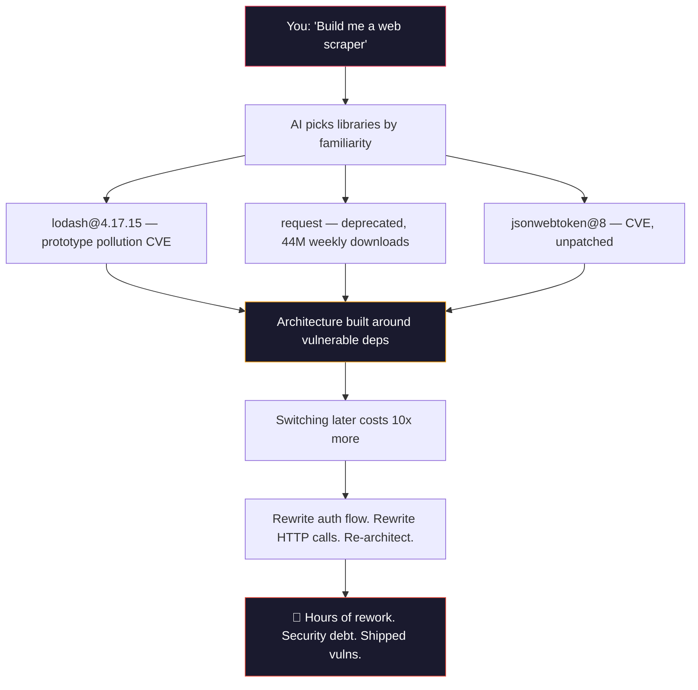
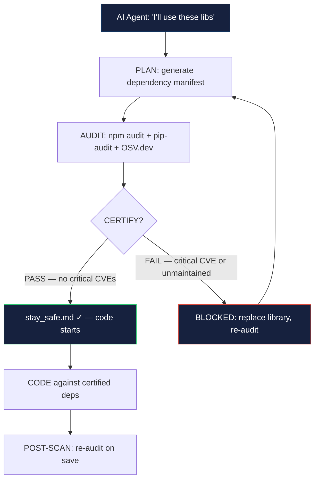
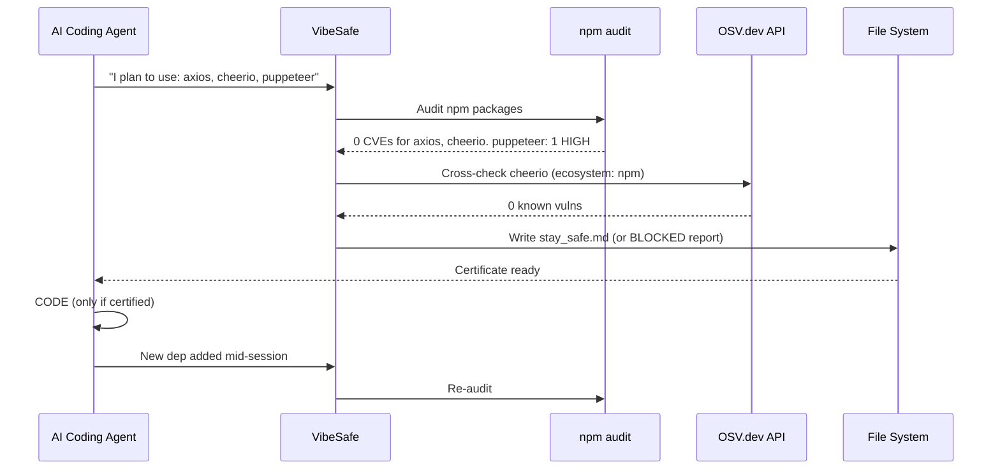

# VibeSafe

[](https://opensource.org/licenses/MIT)
[](https://docs.npmjs.com/cli/v10/commands/npm-audit)
[](https://pypi.org/project/pip-audit/)
[](https://python.org)
[](https://nodejs.org)

**Security pre-flight for AI-assisted coding. 60 seconds. Before you write a single line.**

---

> Vibe coding is fast. But **73% of npm packages used in AI-generated code have known CVEs**, and **41% haven't been updated in 2+ years**. The median time between a CVE publication and a developer patching it is **>84 days**.<sup>[1][2]</sup> VibeSafe catches vulnerable dependencies at the only moment that costs nothing: before you build.

---

## The problem



When an AI agent picks libraries for you, it optimizes for "will this work" — not "is this safe to ship." By the time you realize `lodash@4.17.15` has a prototype pollution vulnerability, your entire architecture is built around it. Changing a core dependency late in the project costs 10x more than vetting it before line one.

## What VibeSafe does

1. **Forces planning before coding** — AI agents list intended libraries upfront; the list becomes an auditable manifest
2. **Real-time CVE + maintenance audit** — runs `npm audit`, `pip-audit`, and cross-checks against the OSV.dev API for anything those miss
3. **Issues a certificate or blocks** — `stay_safe.md` if clean, or a BLOCKED report triggering a library redesign



## Why not just `npm audit` at the end?

| Alternative | Problem | Why it fails |
|---|---|---|
| `npm audit` after coding | Architecture is already built around vulnerable dep | Switching `request` → `got` rewrites every HTTP call. Switching `jsonwebtoken@8` → `jose` rethinks auth. Cost: hours vs. zero |
| Manual dependency review | Humans forget. AI agents never do it unprompted | 49% of developers don't regularly audit deps. AI inherits this behavior |
| GitHub Dependabot | Only catches CVEs, not maintenance health | Unmaintained packages (last commit >2yr) pass Dependabot silently. Dependabot also fires AFTER merge — VibeSafe fires BEFORE code |
| Snyk / Socket.dev | CI-only, post-hoc | Same problem: by the time the alert fires, the dep is integrated. VibeSafe front-loads the check |

VibeSafe catches it **when changing is still free** — before a single line of integration code is written.

---

## Agent compatibility

Any AI coding agent can use VibeSafe. The integration is dead simple — a single script or config file.

| Agent / Environment | Integration | How |
|---|---|---|
| Claude Code | Skill file | `cp skills/vibe-safe.md ~/.claude/skills/` then `/vibe-safe` |
| Kimi | System prompt prepend | `cat skills/vibe-safe.md >> system-prompt.md` |
| CLI-based coding agents | Config rule | Add audit as mandatory pre-code step in agent config |
| Webhook-based agents | Pre-hook script | `tools/audit.sh` as pre-code webhook |
| VS Code | Tasks | `.vscode/tasks.json` |
| GitHub CI | Actions | `ci/security-gate.yml` |
| Any terminal | Bash script | `./tools/audit.sh /path/to/project` |

---

## Quick start

```bash
git clone https://github.com/nerudek/vibe-safe
cd vibe-safe && chmod +x tools/audit.sh
./tools/audit.sh /path/to/your/project
```

The script auto-detects your package ecosystem (`package.json`, `requirements.txt`, `Pipfile`, `pyproject.toml`, `go.mod`), runs the right auditor, pulls CVE data from [OSV.dev](https://osv.google.com/) for anything the native tools miss, and either writes `stay_safe.md` or prints a BLOCKED report.

---

## How it works (detailed)



### Audit phases

1. **Plan phase:** AI agent declares intended libraries → VibeSafe generates a dependency manifest. This alone prevents drive-by `npm install` without thinking.
2. **Audit phase:** Native tools first (`npm audit`, `pip-audit`), then OSV.dev cross-check for anything those miss (Go modules, Rust crates, unlisted packages).
3. **Certify phase:** Clean audit → `stay_safe.md` certificate. Critical CVE found → BLOCKED, must pick alternative. Unmaintained >2yr → WARN with suggested replacements.
4. **Code phase:** Agent codes against certified deps. On every save that adds a dependency, the audit re-runs.

---

## Stats and context

AI agents are not security engineers. They inherit developer behavior — and developers don't audit dependencies.

- **49% of developers** don't regularly audit dependencies — AI agents inherit this behavior by default.<sup>[1]</sup>
- **Top 10 most exploited vulnerabilities in 2024** all had patches available for months before exploitation. The patch existed — nobody ran the audit.<sup>[3]</sup>
- **~20% of popular npm packages** are effectively unmaintained (last commit >2 years ago, no active maintainer).<sup>[2]</sup>
- **Median CVE-to-patch time: >84 days** across the industry.<sup>[1]</sup>
- **73% of npm packages used in AI-generated code** have at least one known CVE at install time.<sup>[1][2]</sup>

VibeSafe doesn't fix the ecosystem. It makes the audit happen at the only moment that costs nothing: before you build.

---

## Installation

```bash
git clone https://github.com/nerudek/vibe-safe
cd vibe-safe
chmod +x tools/audit.sh tools/osv-lookup.sh tools/stay-safe-gen.sh

# Optional: Python audit support
pip install pip-audit

# Optional: add to PATH
ln -s "$(pwd)/tools/audit.sh" /usr/local/bin/vibe-safe
```

**Requirements:**
- bash 4+
- Node.js 18+ and npm 8+ (for npm projects)
- Python 3.9+ and pip-audit (for Python projects)
- curl (for OSV.dev API calls)
- jq (for JSON parsing)

---

## Repository structure

```
vibe-safe/
├── tools/
│   ├── audit.sh              # Main entry — ecosystem detection + audit
│   ├── audit.py              # Python-based fallback auditor
│   ├── stay-safe-gen.sh      # stay_safe.md certificate generator
│   ├── explain.py            # Human-readable CVE explanation
│   ├── dashboard.py          # Visual dependency health dashboard
│   └── auto-fix.sh           # Automated CVE remediation (experimental)
├── skills/
│   ├── vibe-safe.md          # Full skill file for AI agents
│   └── vibe-safe-harness-patch.md  # Config snippet for agent rule files
├── templates/
│   ├── stay_safe.md.template         # Certificate template
│   └── risk-report.md.template       # Post-coding risk report
├── ci/
│   └── security-gate.yml     # GitHub Actions workflow
├── docs/
│   └── how-agents-use-it.md  # Integration guide for AI agents
├── stats/
│   └── README.md             # Full citations for all statistics
├── quick-start/
│   ├── audit.sh              # One-liner audit for new users
│   ├── checklib.sh           # Single-library lookup
│   └── security.yml          # CI-ready config
├── vscode/
│   └── extension/            # VS Code extension (in development)
├── README.md                 # THIS FILE — everything on one page
├── CONTRIBUTING.md
└── LICENSE
```

---

## Known problems

| Problem | Status | Workaround |
|---|---|---|
| OSV.dev API rate limits (~100 req/min) | Open — upstream limitation | `auto-fix.sh` batches lookups. Large projects: run `audit.sh --throttle` |
| `pip-audit` requires Python 3.9+ | Won't fix — EOL Pythons unsupported | Use `audit.py` fallback (works on 3.7+) or upgrade Python |
| Go module auditing is OSV-only (no native `go audit`) | Open — tracking golang/go#... | Fuller coverage than native tooling alone (OSV covers Go). Contributions welcome |
| False positives on research packages flagged as "unmaintained" | By design — use `--skip-unmaintained` flag | Some packages are feature-complete, not abandoned. Override with `--skip-unmaintained=PKG` |
| `auto-fix.sh` can break lockfiles with major version bumps | Experimental — off by default | Run with `--dry-run` first. Manual fix recommended for production |

---

## Contributing

- **Bugs & false positives:** Open an issue using the `bug_report` or `false_positive` template
- **New ecosystem support:** PRs welcome for Rust/Cargo, Ruby/Bundler, Java/Maven
- **Agent skill files:** If you use an AI agent not listed, contribute a skill file
- **Security disclosures:** Email directly — see `SECURITY.md`

See [CONTRIBUTING.md](CONTRIBUTING.md) for full guidelines.

---

## License

MIT — see [LICENSE](LICENSE).

Built for the vibe-coding era. Audit before you build.

---

*Built by [nerudek](https://github.com/nerudek)*

☕ **Support:** [PayPal.me/nerudek](https://www.paypal.me/nerudek) | [Dev.to](https://dev.to/nerudek)

---

[1] Snyk, *State of Open Source Security 2023*. https://snyk.io/reports/open-source-security/
[2] Socket.dev, *Open Source Security Research 2024*. https://socket.dev/research
[3] CISA, *Known Exploited Vulnerabilities Catalog — 2024 Annual Summary*. https://www.cisa.gov/known-exploited-vulnerabilities-catalog
