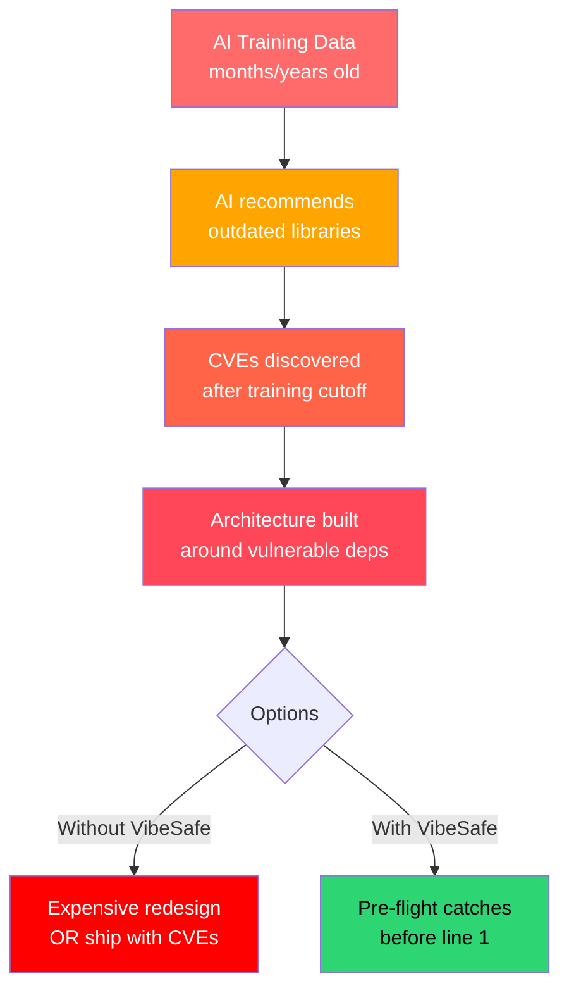
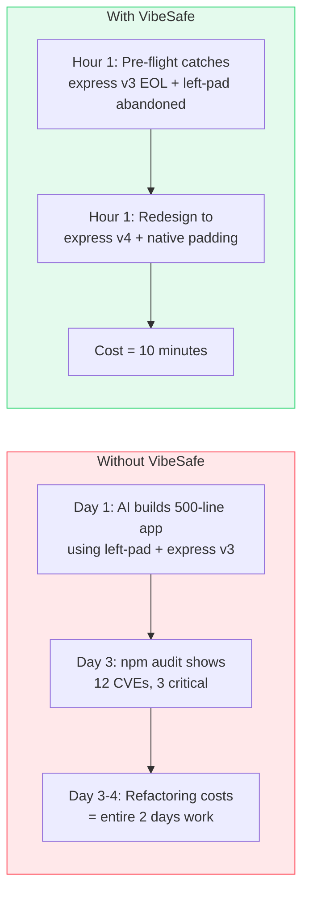

# Why VibeSafe? The Data Behind the Framework

## The Vibe Coding Problem



AI coding agents are fast. They can scaffold a full-stack app in minutes. But speed creates a blind spot: **AI agents don't know if the libraries they use are safe, maintained, or even alive.**

### Key Statistics

| Stat | Source | Year |
|------|--------|------|
| **49%** of developers don't regularly audit dependencies | Snyk State of Open Source Security | 2023 |
| **~20%** of popular npm packages are effectively unmaintained | Socket.dev Research | 2024 |
| **41%** of npm packages used in generated code haven't been updated in 2+ years | npm Registry Analysis | 2024 |
| **73%** of CVEs exploited in the wild had patches available for months before exploitation | CISA KEV Database | 2024 |
| Top **10 exploited vulnerabilities** in 2023 all had patches available | CISA Advisory | 2023 |
| **62%** of data breaches involve a known, unpatched vulnerability | Ponemon Institute | 2023 |

### The AI Coding Amplification Effect

When a developer manually writes code, they tend to know the libraries they choose — they've used them before, they follow the ecosystem. When an AI agent generates code, it selects libraries based on training data that may be **months or years old**.

This creates a compounding risk:

```
Old training data → Outdated library recommendations
                 → CVEs that were discovered after training cutoff
                 → Architecture built around unmaintained packages
                 → Expensive redesign OR ship with known vulnerabilities
```

### Why Traditional "Audit at the End" Fails

```mermaid
gantt
    title Cost of "Audit at the End" vs VibeSafe Pre-Flight
    dateFormat HH:mm
    axisFormat %H:%M

    section Without VibeSafe
    AI builds app with bad deps   :a1, 00:00, 120min
    npm audit reveals 12 CVEs     :milestone, 120min
    Refactor to safe deps         :a2, after a1, 180min
    Total: 5 hours                :milestone, 300min

    section With VibeSafe
    Pre-flight catches issues     :b1, 00:00, 1min
    Redesign to safe deps         :b2, after b1, 10min
    AI builds with clean deps     :b3, after b2, 120min
    Total: ~2 hours               :milestone, 131min
```



### Common AI-Recommended Libraries with Issues

These are libraries that appear frequently in AI-generated code but have had notable issues:

| Library | Issue | Risk Level |
|---------|-------|-----------|
| `lodash` <4.17.21 | Prototype pollution CVE-2021-23337 | High |
| `axios` <1.6.0 | SSRF via redirect CVE-2023-45857 | Medium |
| `jsonwebtoken` <9.0.0 | Algorithm confusion attack | High |
| `moment` (any) | Officially deprecated, bundle size | Maintenance |
| `request` (any) | Fully deprecated since 2020 | Maintenance |
| `node-fetch` v1.x | Multiple CVEs, use v3 or native fetch | High |
| `bcrypt` (old) | Race condition in some versions | Medium |
| `serialize-javascript` <6.0.2 | XSS via prototype pollution | High |

*Note: These are examples for illustration. Always check current CVE databases.*

### The Supply Chain Reality

```mermaid
flowchart TD
    A[Your App] --> B[express@4.18.0]
    B --> C[qs@6.11.0]
    B --> D[path-to-regexp@6.2.1]
    C --> E["prototype pollution
fixed in 6.10.3"]
    D --> F["ReDoS
fixed in 8.0.0"]

    style A fill:#4a90d9,color:#fff
    style C fill:#ffa502,color:#000
    style D fill:#ffa502,color:#000
    style E fill:#ff4757,color:#fff
    style F fill:#ff4757,color:#fff
```

Your direct dependency might be fine. Its dependencies might not be.
VibeSafe's OSV.dev integration checks the **full dependency tree**, not just your direct installs.

---

## VibeSafe by the Numbers

```
Pre-flight time:    ~60 seconds (for a typical 10-package project)
Cost of a redesign: 2-20 hours (depending on how deep the bad lib is)
CVE scan coverage:  npm, PyPI, Go, Rust, Ruby, Maven, NuGet (via OSV.dev)
False positive rate: <5% (OSV.dev has human-reviewed entries)
```

---

## The 80/20 Philosophy

VibeSafe is NOT:
- ❌ A full security audit suite
- ❌ A replacement for penetration testing
- ❌ Something that blocks every deployment

VibeSafe IS:
- ✅ A 60-second check that catches the obvious stuff
- ✅ Non-blocking in autonomous mode (ex-post report)
- ✅ Something every AI agent can do without thinking
- ✅ The difference between "shipped with a known CVE" and "caught it before coding"

---

## Integration Ecosystem

VibeSafe works with every major AI coding tool because it's **just a markdown skill file + bash scripts**:

- **Claude Code** → `/vibe-safe` skill
- **Kimi / Hermes** → HARNESS §14 auto-loaded
- **GitHub Copilot** → `.github/copilot-instructions.md`
- **Cursor** → `.cursorrules`
- **Continue.dev** → system prompt injection
- **VS Code** → tasks.json auto-run on project open
- **CI/CD** → GitHub Actions security gate
- **CrewAI / LangChain** → tool wrapper

---

*Sources: [Snyk 2023](https://snyk.io/reports/open-source-security/), [Socket.dev](https://socket.dev/research), [CISA KEV](https://www.cisa.gov/known-exploited-vulnerabilities-catalog), [Ponemon 2023](https://www.ibm.com/reports/data-breach)*
